# Personal Portfolio Web App

<p align="center">
  
</p>

<p align="center">
A modern, responsive portfolio web application built with Flask, Docker, and GitHub Actions.
This project showcases software engineering skills, project highlights, and a knowledge map, 
all deployable with production-ready best practices.
</p>


## 🚀 Features

- **Flask-based web app** with modular templates and Bootstrap 5 styling
- **Responsive UI** with custom themes and interactive knowledge map
- **Dockerized** for easy local and production deployment
- **GitHub Actions CI/CD** for automated Docker image build and deployment
- **HTTPS support** with automatic HTTP→HTTPS redirection in production
- **Health check endpoint** for monitoring
- **Configurable via environment variables** for secrets and SSL


## 📊 Deployment Pipeline

```mermaid
flowchart LR
    A[👨‍💻 Developer] --> B[📝 Git Push to main]
    B --> C[🔄 GitHub Actions]
    C --> D[🐳 Docker Build]
    D --> E[📦 Push to Docker Hub]
    E --> F[🚀 Deploy to Server]
    F --> G[✅ Health Check]
    
    subgraph "🏗️ Build Process"
        D --> D1[Copy Files]
        D1 --> D2[Install Dependencies]
        D2 --> D3[Configure Gunicorn]
    end
    
    subgraph "🖥️ Server Infrastructure"
        F --> F1[🐋 Docker Compose Up]
        F1 --> F2[🌐 NGINX Proxy]
        F2 --> F3[🔒 SSL/HTTPS]
        F3 --> F4[🌍 Domain Access]
    end
    
    style A fill:#e1f5fe
    style G fill:#c8e6c9
    style F4 fill:#fff3e0
```


## 🏗️ Runtime Architecture

```mermaid
flowchart TD
    subgraph "🌐 Internet"
        U[👤 User Request]
        D[🌍 yourdomain.com]
    end
    
    subgraph "🏠 Home Network"
        R[🌐 Router<br/>Port Forward<br/>80/443]
    end
    
    subgraph "🖥️ Your Server"
        N[⚡ NGINX<br/>Reverse Proxy<br/>SSL Termination]
        
        subgraph "🐳 Docker Container"
            G[🦄 Gunicorn<br/>WSGI Server]
            F[🐍 Flask App<br/>app.py]
        end
        
        subgraph "📁 App Structure"
            T[📄 Templates<br/>Jinja2 HTML]
            S[🎨 Static Files<br/>CSS, Images, JS]
            C[⚙️ Config<br/>gunicorn_config.py]
        end
    end
    
    U --> D
    D --> R
    R --> N
    N --> G
    G --> F
    F --> T
    F --> S
    F --> C
    
    subgraph "🛣️ Flask Routes"
        F --> H1[🏠 Home /]
        F --> H2[👤 About /about]
        F --> H3[📞 Contact /contact]
        F --> H4[📄 Resume /resume]
        F --> H5[❤️ Health /health]
    end
    
    style U fill:#e3f2fd
    style D fill:#e8f5e8
    style N fill:#fff3e0
    style F fill:#f3e5f5
    style G fill:#e0f2f1
```


## 🛠️ Local Development Setup

1. **Clone the repository:**
   ```sh
   git clone https://github.com/Burger-Byte/portfolio-web.git
   cd portfolio-web
   ```

2. **Install Python dependencies:**
   ```sh
   python -m venv venv
   source venv/bin/activate  # On Windows: venv\Scripts\activate
   pip install -r requirements.txt
   ```

3. **Run the Flask app:**
   ```sh
   python app.py
   ```
   The app will be available at [http://localhost:80](http://localhost:80) or [http://localhost:5000](http://localhost:5000) depending on your environment.

---

## 🐳 Docker Setup

1. **Build the Docker image:**
   ```sh
   docker build -t portfolio:latest .
   ```

2. **Run with Docker Compose:**
   ```sh
   docker-compose up -d
   ```
   - The app will be available on ports 80 (HTTP) and 443 (HTTPS, if SSL certs are provided).
   - Environment variables and volumes are configured in `docker-compose.yaml`.

---

## 🔒 SSL & Production Deployment

- **SSL Certificates:**  
  Place your SSL certificates in `/etc/letsencrypt/live/yourcoolendpointhere/` (or update `SSL_CERT_PATH` and `SSL_KEY_PATH` in your environment).
- **HTTP→HTTPS Redirect:**  
  In production, the app automatically redirects HTTP traffic to HTTPS.
- **Health Check:**  
  The `/health` endpoint returns a JSON status for uptime monitoring.

---

## ⚙️ CI/CD with GitHub Actions

- On every push to `main`, [deploy.yaml](.github/workflows/deploy.yaml) will:
  1. Build and push the Docker image to Docker Hub.
  2. Deploy the latest image to your server via Docker Compose.
  3. Run a health check to verify deployment.

---

## 🔑 Environment Variables

Key environment variables (see `docker-compose.yaml`):

- `FLASK_ENV=production`
- `SECRET_KEY=your-secret-key`
- `SSL_CERT_PATH` and `SSL_KEY_PATH` for HTTPS
- `DOCKER_USERNAME` for Docker Hub authentication

---

## 📄 Customization

- **Profile & About Info:**  
  Update the `PORTFOLIO_DATA` dictionary in [`app.py`](app.py) for your name, title, links, and summary.
- **Projects:**  
  Add your projects to the relevant data structure and templates.
- **Styling:**  
  Modify CSS in `portfolio_base.html` or add static assets as needed.

---

## 📝 License

This project is for personal portfolio use. Feel free to fork and adapt for your own portfolio!

---

## 🙋‍♂️ Contact

Questions or feedback?   
LinkedIn: [Jaques Burger](https://www.linkedin.com/in/jaques-b-0519358a/)

---